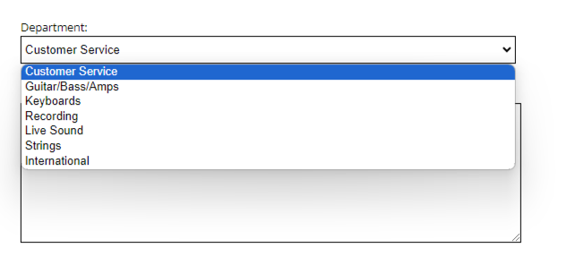

This is a mock up of SamAsh.com musical website.<br>

<h3>HTML requirements</h3>
The website consists out of three text-populated pages with consistent grid:
<ul>
<li>Home page, or index.html</li>
<li>Customer support page, or help.html</li>
<li>Register an account page, or register.html</li>
</ul>
index.html can be navigated to by clicking main SamAsh logo in the top left corner of the website.
help.html can be navigated to by clicking on 'Help' in the left section of top navigation bar, and register.html by clicking on "Log In / Register' in the right section of top navigation bar. Each contains a form.
<br>
The website utilizes multiple HTML tags, including <code>nav</code>, <code>main</code>, <code>form</code>, <code>fieldset</code>, <code>table</code> <code>footer</code> etc.
<br>
The table is used in the footer of every page and contains 'About Us', 'Customer Support' and 'Quick Links' table headers.
<br>
A dropdown menu is placed inside help.html and allows to make a choice of department.

<br>
Many different images are used thoughout in order to create an appealing look. Gifs are used in the footer of every page. Twitter and Facebook social media icons are gifs.
<br>
<hr>
<h3>CSS requirements</h3>
Inline, internal and external styling is used. Using inline only by accident as <code>svg</code> of a search icon contained inline styling:
<br>
```
xmlns="http://www.w3.org/2000/svg" width="26" height="26" fill="currentColor" class="bi bi-search" viewBox="0 0 16 16"
```
<br>
<br>
Multiple CSS selectors are used in order to achieve a fully customized website. 
<br>
Alignment of elements is achieved through flexbox only.
<br>
Two elements are animated: top advertisement and shopping cart.
The top advertisement is appearing on the left, moves horizontally across viewport and disappears on the right. The effect is achieved via moving the animated element with <code>transform:translateX()</code>.
The shopiing cart is animated once with <code>transform: rotate()</code>.
